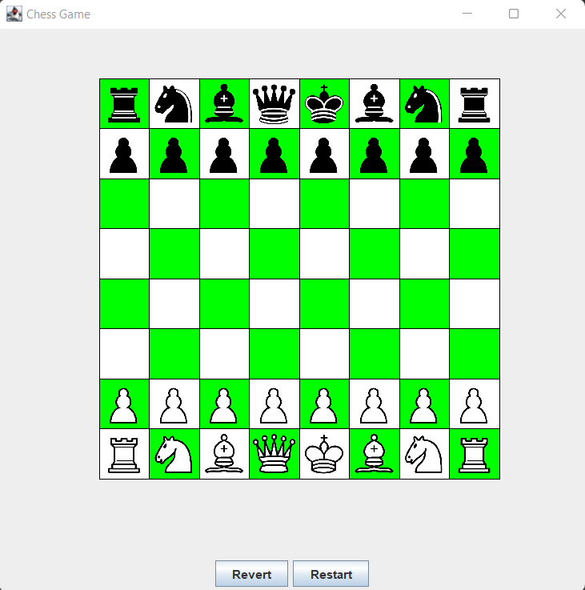

# Chess Game

This project, started on January 2022, aims at creating a chess game in **Java**.

The goal of this project is for me to learn Java and develop my algorithm skills through a complex game like Chess.

## Game overview

## TO DO

- on revert, check if last move was a rock and put canRock to true for king and towers
- implement en passant method for pawn